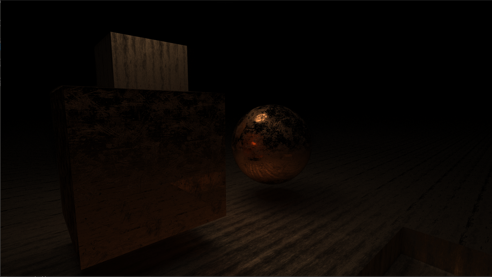

# gpu path tracer

__[Video](https://www.youtube.com/watch?v=U3DYW4FLjCc&feature=youtu.be)__

__Controls:__
* mouse movement: look around
* WS: forward and backward
* AD: left and right
* left shift, space: down and up

__Dependencies:__
* OpenGL 4.3
* glew
* glfw3
* glm
* C++11 compiler
